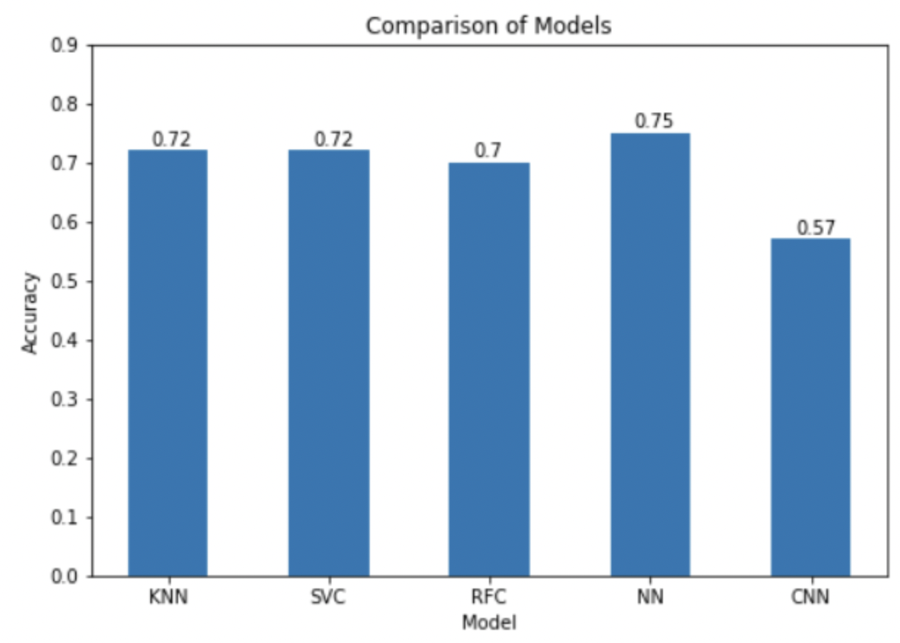
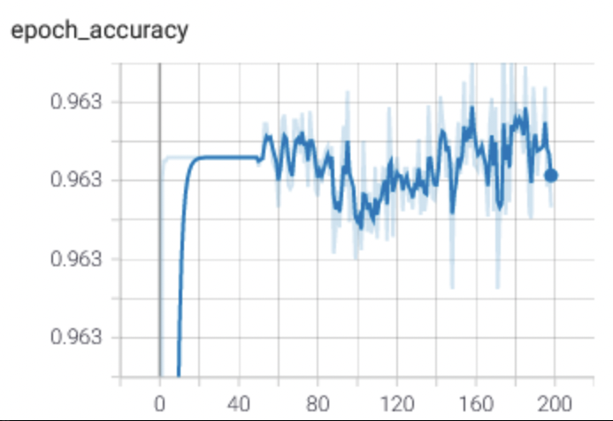
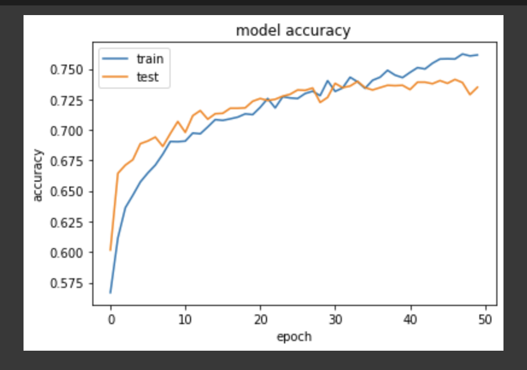
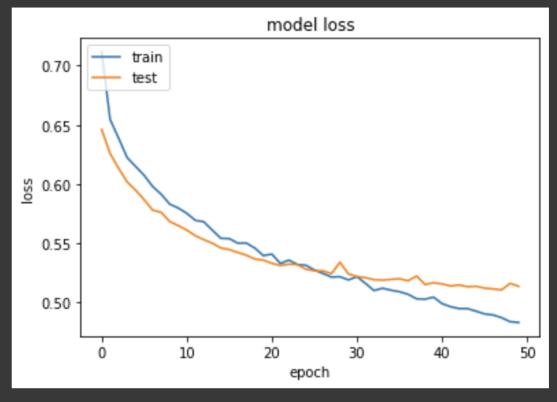

# Portfolio
Welcome! My name is Raj and if I had to describe myself in 3 words I would say that I am extremely motivated, confident in my identity and abilities, but most of all, curious. Knowledge can be gleaned from any source. When I'm not cracking away at a project, I'm listening to podcasts about society, philosophy, nutrition and the human condition while at the gym. When I'm not learning a new skill, I'm reading a book written by my favorite sports athletes, psychologists, and businessmen. And when I'm not working on this website, I'm visiting new restaurants with friends or cooking for them!
Currently, I am working with the director of data science at my grad school on a security model for human-computer interaction applications using a custom EMG sensor provided by Georgia Tech.
Out of the projects I've done since my undergrad days starting 2017, here are the 3 most interesting and challenging ones. 

# [Project 1 : Music-Classifier](https://github.com/rajkumar464/Music-Classifier)

* Built a Python web application to classify user-provided input song into 1 of 10 genres and also perform source separation into vocals, bass, drums and accompaniments for music producers, educators and streaming platforms' classification systems.
* Fabricated an ensemble Random Forest Classifier model and trained it on 1000 different songs (100 per genre) and performed better than previous methods based on waveform analysis with an accuracy of 70%.
* Created 4 CNN masking models to predict binary masks for isolating each element i.e. vocals, bass, percussion and accompaniments, with the bass masking model achieving an accuracy of 96.3%.
* The system was proposed and published at the IEEE-Sponsored International Conference on Advancements in Electrical, Electronics, Communication, Computing and Automation (2021). Link to the publication : [IEEE](https://ieeexplore.ieee.org/document/9675518)
For more information, please check out this presentation : [Presentation](https://docs.google.com/presentation/d/1D4YVrl-OZT2HIdfohhjBfBVMJv2G5B1J7Qx2KvqL_6Y/edit?usp=sharing)

# [Project 2 : User Profiling on Social Media](https://github.com/rajkumar464/User-Profiling-on-Social-Media)

* The aim of the project is to build a system that automatically predicts the age category, gender, and personality scores of Facebook users when given input of status updates, profile picture, and "likes" of the users. We have been given 9500 training instances of real sensitive Facebook user data. The program takes input from a source specified by the user and also outputs the results to a user-specified directory
* The project is three-pronged with 3 team members each using a different source. The three sources used are : 
1. Text
2. Images
3. Likes 
* Built a deep learning model based on VGG-16 architecture and trained on 9500 RGB JPEG images of varying dimensions sourced from Facebook to predict 1334 users' characteristics.
* Rendered results in XML files stored in a custom local directory upon executing a Linux shell command that took input from a directory specified by the user.
* For more information, please contact me as the report contains sensitive information.

# [Project 3 : YouTube Channel Analytics Dashboard](https://github.com/rajkumar464/YouTube_Dashboard)

* An interactive dashboard to view your channel's performance over several different measures and also analyze each video's performance, built using Streamlit.
* The dataset contains 4 .csv files pertaining to a YouTuber's channel. Source : Kaggle
*  The dashboard has two sections :
1. Aggregate Metrics
* This section displays a few metrics comparing performance over the last 6 months with the entire year.
2. Individual Video Analysis
* Here, one can select a particular video and view the geographic distribution of viewers and also their subscriber status.
* Also, one can observe the rate at which the number of views increases over time, with the 20th percentile, 80th percentile, 50th percentile (median) and increase in views over the first 30 days for the selected video.
